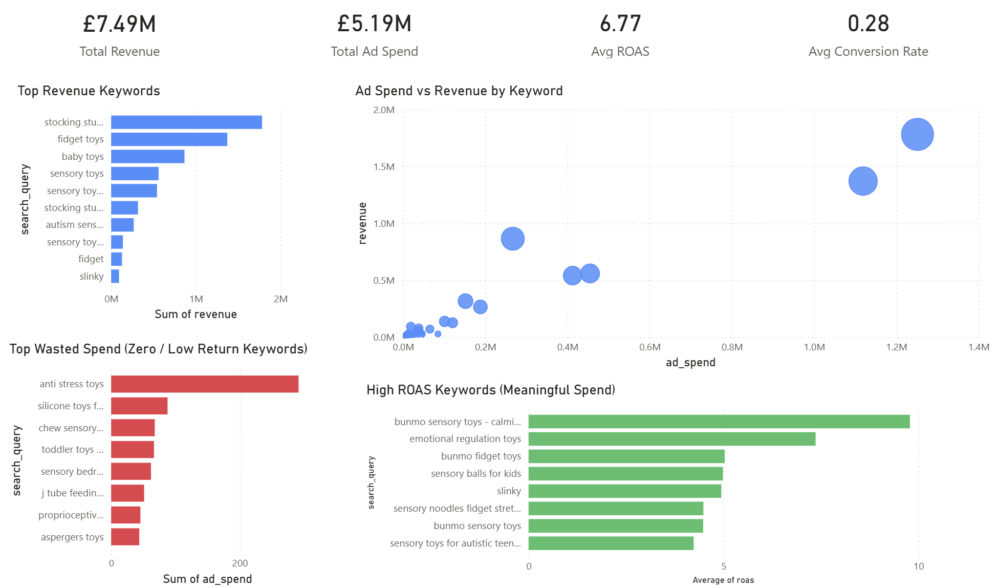

# Amazon Ads Performance Audit

In this project, I analysed Amazon advertising performance at the search query level to identify opportunities to improve return on ad spend, reduce wasted budget, and highlight scalable keyword opportunities.

The analysis focuses on search query efficiency, revenue concentration, conversion performance, and low-return spend.

The goal was to simulate the kind of keyword-level advertising audit that an Amazon seller might use to improve campaign profitability and budget allocation.

## Featured Dashboard

## Key Metrics

- Total Revenue: **£7.49M**
- Total Ad Spend: **£5.19M**
- Average ROAS: **6.77**
- Average Conversion Rate: **28%**

## Key Findings

### 1. Revenue is concentrated in a small number of keywords
A limited set of search queries, such as **stocking stuffers**, **fidget toys**, and **baby toys**, generated a disproportionately large share of total revenue.

This suggests strong performance in a few core keyword groups, but also creates a level of dependency on a small number of revenue drivers.

### 2. Diminishing returns appear at higher ad spend levels
The relationship between ad spend and revenue was not fully linear. Higher-spend keywords generated strong revenue, but often with weaker efficiency.

This suggests that increasing spend indiscriminately may reduce return on ad spend rather than improve overall profitability.

### 3. High-efficiency keywords are currently underutilised
Several keyword groups delivered strong ROAS at relatively low levels of spend, particularly in sensory and autism-related niches.

These keywords appear to represent opportunities for controlled scaling, as they show evidence of strong customer intent and efficient ad performance.

### 4. Some spend is being wasted on low- or zero-return keywords
A number of keywords generated little or no revenue despite receiving ad spend.

This indicates budget leakage and highlights the need for tighter keyword optimisation and pausing underperforming terms.

### 5. Sensory and autism-related keywords show strong conversion potential
Keywords linked to sensory toys, autism-related products, and specific niche product terms showed consistently strong conversion performance.

This suggests a clear product-market fit within those segments and creates a strong case for expanding coverage in those keyword clusters.

## Opportunities

### Scale high-ROAS keywords
Keywords with strong efficiency but relatively low spend should be considered for incremental budget increases and close monitoring.

### Expand high-converting niches
Sensory toy and autism-related queries appear to align well with customer intent and may offer further growth opportunities through broader keyword targeting.

### Optimise mid-tier performers
Keywords with moderate spend and acceptable conversion rates may benefit from bid refinement, creative testing, or campaign restructuring.

## Risks

### Inefficient high-spend keywords
Some of the highest-spend keywords delivered relatively low ROAS, creating a risk that a large share of budget is being deployed inefficiently.

### Revenue concentration
Heavy reliance on a small number of keywords may expose performance to increased competition, CPC inflation, or shifts in seasonal demand.

### Ongoing non-converting spend
Low-performing keywords with little or no return represent avoidable cost and reduce overall advertising efficiency.

## Recommendations

1. Reduce spend on low-efficiency keywords, particularly those with weak ROAS or zero revenue.
2. Reallocate budget towards high-ROAS keyword groups with stronger conversion potential.
3. Scale high-performing niche keywords gradually and monitor efficiency closely during expansion.
4. Expand keyword coverage around strong-performing sensory and autism-related product themes.
5. Continue optimising high-revenue keywords to improve ROAS rather than simply increasing spend.

## Dashboard Overview

The Power BI dashboard was designed to support fast decision-making by highlighting:

- Top revenue-driving keywords
- High ROAS keywords with meaningful spend
- Wasted spend on low- and zero-return keywords
- The relationship between ad spend and revenue across keyword groups

## Tools Used

- Python
- Pandas
- NumPy
- Matplotlib
- Power BI

## Conclusion

In this project, I identified a clear opportunity to improve advertising efficiency through better keyword targeting, tighter budget allocation, and more deliberate scaling of high-performing search terms.

Rather than increasing spend broadly, the results suggest that stronger performance is more likely to come from reallocating budget towards efficient keyword groups and reducing wasted spend on poor performers.
